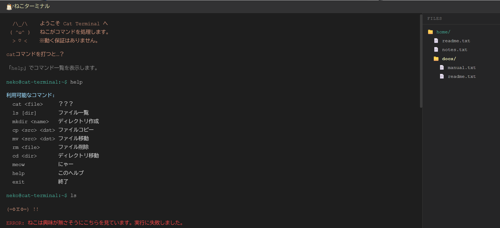
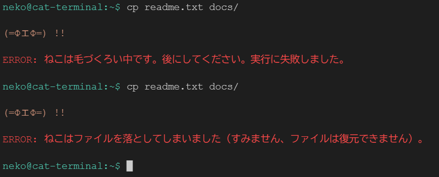

# ねこターミナル

ブラウザで動くターミナルシミュレーター。ただし、コマンドを処理するのはねこです。

**[▶ 今すぐ遊ぶ](https://cat-terminal.neko-engineer.com/)**

---

## どんなもの？

ターミナル風のUIでコマンドを入力すると、ねこがファイル操作を行ってくれます。  
ただし、**約50%の確率で失敗します**。ねこなので。

`cp` や `mv` の失敗時にはファイルが消えることもあります（ねこが落としました）。

`cat` コマンドを打つと…？

## イメージ画像



### ねこなので失敗します



### イメージキャラクター

ねこターミナル


ターミナルは**空港**という意味もあるので、機長や空（水色）をイメージしたキャラクターです！

## コマンド

| コマンド | 説明 |
|---|---|
| `ls [dir]` | ファイル一覧 |
| `mkdir <name>` | ディレクトリ作成 |
| `cp <src> <dst>` | ファイルコピー（落とすかも） |
| `mv <src> <dst>` | ファイル移動（落とすかも） |
| `rm <file>` | ファイル削除（気に入ってたら断られる） |
| `cd <dir>` | ディレクトリ移動 |
| `cat <file>` | ？？？ |
| `meow` | にゃー |
| `help` | コマンド一覧 |
| `exit` | 終了 |

## 技術仕様

- 静的サイト（ビルド不要）
- ファイルシステムはメモリ上のみ（リロードでリセット）
- Google Analytics 4 でコマンド利用状況を計測

## ローカルで動かす

```bash
# HTTPサーバーが必要（file:// では ES modules が動かないため）
npx serve docs
# → http://localhost:3000
```
